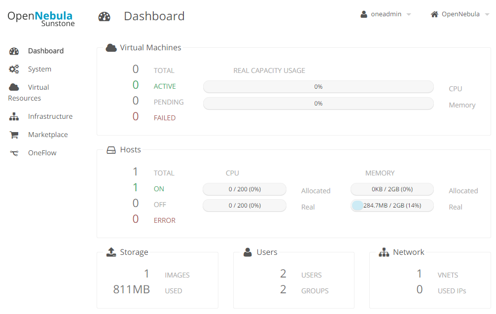

# Description

EYWA PoC, OpenNebula on Vagrant Environment

# EYWA Architecture


# Dashboard



# Installation

## Build Master Node (Front-end)

```bash
host> vagrant up master
host> vagrant ssh master
master> sudo /home/vagrant/config-one-env.sh
```

### (Note) config-one-env.sh

* Create Virtual-Network
* Create Image (CentOS 6.5 x86_64)
* Create Template (CentOS-6.5_64)

## Build Slave Nodes

```bash
host> vagrant up slave-1
host> vagrant up slave-2
```

## (Option) Using Desktop VNC

* Connecting /w VNC

```
VNC Address: {Vagrant-Host-IP}:55900
```

## Web-UI
  * http://{Host-IP}:9869
  * Admin ID/PW: oneadmin / passw0rd

## Launch VM

### Create Test VM

* in Web-UI, "Virtual Resource" Tab, and "Vritual Machines" Tab
* Click "+" button

### SSH Connect to VM

```
on master or slave-{n}

ssh -i /var/lib/one/.ssh/id_rsa root@{vm_ip_address}
```

## APPENDIX

* OpenNebula's VNC Console is not supported. Because of Port Forwarding (>5900, Dynamic)
