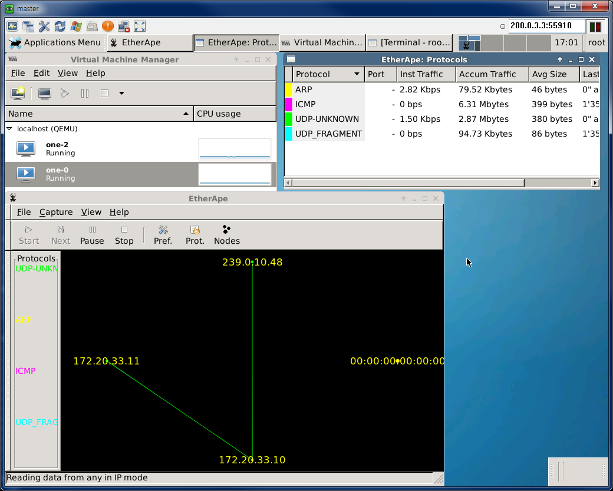
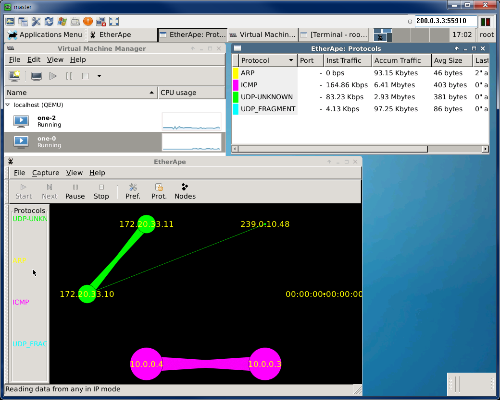
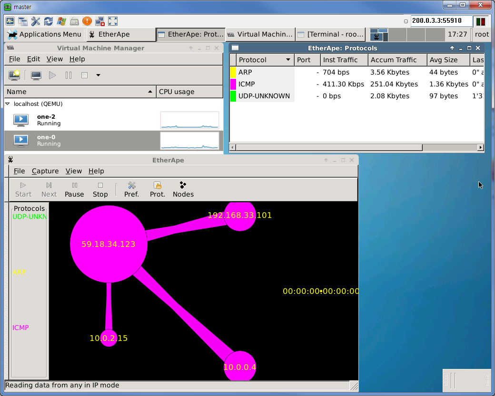

Description
=============

EYWA PoC, OpenNebula on Vagrant Environment

[PoC-Demo Video (YouTube)](https://youtu.be/FsXDuiWqmJk)

## (Note for Git)

* On MS-Windows family, may be "\^M" EOL troube...
* (Recommended) Before "Git Clone", Running "git config --global core.autocrlf true"

## Vagrant PoC Env.

### Virtualization Provider

* Tested on VirtualBox 4.3.26.r98988

### Networking

* Vagrant Management Network
 * eth0: "NAT"
* External Network
 * eth1: "Host-Only Adapter"
 * 192.168.33.0/24 (GW: 192.168.33.2)
  * Range: 192.168.33.101 ~ 192.168.33.200 (100 EA)
 * Promiscuous: "Allow All"
* Internal Network
 * eth2: "Internal Network"
 * 10.0.0.0/8 (GW: 10.0.0.1) (16777216 EA)
 * Promiscuous: "Allow All"
* VXLAN Range (MySQL Database: eywa)
 * 239.0.0.0 ~ 239.0.1.155 (4096 EA)

# EYWA Architecture


# Dashboard


# Prepare

## Deploy Master Node (Front-end)

(Note) When connect SSH, ignore "*** System restart required ***" message.

```bash
host> vagrant up master
host> vagrant ssh master
master> sudo /home/vagrant/config-one-env.sh
```

## Deploy Slave Nodes

```bash
host> vagrant up slave-1
host> vagrant up slave-2
```

## (Option) Using VNC

* (Note) VNC Password: passw0rd

```bash
[master]
VNC Address: {Vagrant-Host-IP}:55910

[slave-1]
VNC Address: {Vagrant-Host-IP}:55911

[slave-2]
VNC Address: {Vagrant-Host-IP}:55912
```

## OpenNebula Admin Web-UI
  * http://{Host-IP}:9869
  * Admin ID/PW: oneadmin / passw0rd

## PoC Scenario

+ Log in to Web-UI, by "oneadmin" user.
+ Go to "System" Tab -> "Users" Tab.
+ Click "+" Button.
+ Create "oneadmin" User. (Password is that you want.)
* Default Templates is generated. (in "Templates" Tab)
+ EYWA-Virutal-Router(VR-1) is automatic launched. (in "Virtual Machines" Tab)
* When VR-1 is up, Create EYWA-VM(VM-1).
* Add VR-2 for LB/HA
* Add VM-2.
* Test Ping, to/on all Nodes.

### SSH Connect to VM

on master or slave-{n}
```bash
ssh root@{VR-IP(External)}
ssh root@{VM-IP}
```

## APPENDIX

### Example: Screenshots of Monitoring EtherApe-GUI

* Env.
 * VR-1 IP: eth0:192.168.33.101, eth1:10.0.0.2,10.0.0.1 (on-master)
 * VM-1 IP: eth0:10.0.0.3 (on slave-1)
 * VM-2 IP: eth0:10.0.0.4 (on master)

#### Connect to VM-2

```bash
master> ssh root@192.168.33.101
VR-1> ssh root@10.0.0.4
VM-2> (root's Prompt)
```

#### arping, VM-2 to VM-1

```bash
VM-2> arping 10.0.0.3
```



#### ping, VM-2 to VM-1 (Internal)

```bash
VM-2> ping -s 5000 10.0.0.3
```



#### ping, VM-2 to google.com (External)

```bash
VM-2> ping -s 5000 -M want 10.0.0.3
```


