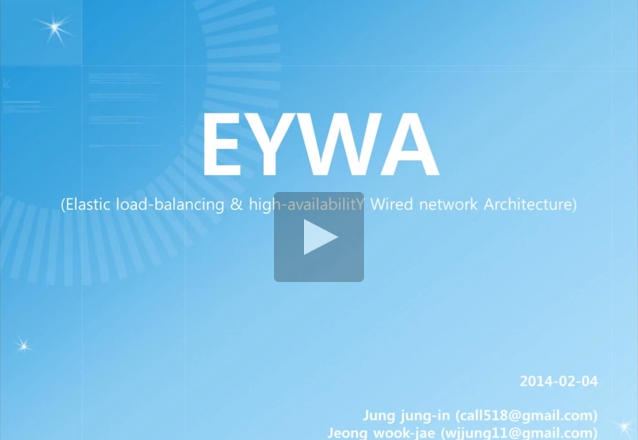

# Description

**SandBox for EYWA PoC**

Distributed Virtual Router Networking /w OpenNebula Cluster (on Vagrant Environment)

(Note) Currently VirtualBox is not supporting nesting VT-X, so simulation VMs is slow.

(Note) In Windows, Configure "core.autocrlf = input" in you Git Env, because "^M"

## PoC-Demo Video

<a href="https://www.youtube.com/watch?v=FsXDuiWqmJk" alt="Click to watch the Video of PoC" target="_blank">
  
</a>

## Features

### The Benefits of EYWA

1. Performance
 * Load Balancing by Multiple VR (No Limit)
2. High Availability
 * HA by Multiple VR (No Limit)
3. Traffic Engineering
 * Save of Network Bandwidth
 * Traffic Isolation by VxLAN (16,777,216)
 * Multicast instead of Broadcast
 * Decrease in Packet Floods
 * Flat Address
 * Multiple Gateway for Load-balancer of Inbound & Outbound Traffic
4. Cost
 * Multiple VR instead of L4 Switch (Single Router)
 * Scalable VR

#### in Public Network

1. Load Balancing
 * Load Balancing by Unlimited VRs(Virtual Router)
 * Scale-out
 * Load balanced Inbound & Outbound Traffic
2. High Availability
 * HA by Unlimited VRs
3. Traffic Engineering
 * Save of Network Bandwidth
 * Low latency
4. VM Migration

#### in Private Network

1. A large number of tenants
 * A large number of VLANs
 * Traffic Isolation by VxLAN (16,777,216)
2. Large layer 2 network
 * 10.0.0.0/8 (16,777,216 IPs) per Tenant
 * Multicast instead of Broadcast, by VxLAN
 * Decrease in MAC Flooding, by VxLAN
 * Eliminate Broadcast (ToDo)


## Vagrant PoC Env.

### Compatibility

* Support OpeNebula 4.6 & OpenNebula 4.10 (Default: OpenNebula 4.10)
* Tested Hypervisor: KVM
* Tested Store: NFS Shared, Qcow2(Default Datastore)
* Edit Vagrantfile to change OpenNebula version
 * "opennebula_version" Parameter

### Download Images Info.

* Public Repository: OneDrive
 * Folder-Link: http://1drv.ms/1BcJiDq (Read-Only)
 * Detail-Info: http://www.evernote.com/l/ACma0cNe1CdCKLQFaDn6U3ukySYCWS6tmeM/
 * (Note) If puppet *.pp Download(wget) is failed, check link url. (and feeback to me)
* EYWA-Router Template
 * "EYWA-Ubuntu-14.04_64.qcow2.gz"
 
### Virtualization Provider

* Tested on VirtualBox 4.3.26.r98988

### Networking

* Vagrant Management Network
 * eth0: "NAT"
* External Network
 * eth1: "Host-Only Adapter"
 * 192.168.33.0/24 (GW: 192.168.33.2)
  * Range: 192.168.33.101 ~ 192.168.33.200 (100 EA)
 * Promiscuous: "Allow All"
* Internal Network
 * eth2: "Internal Network"
 * 10.0.0.0/8 (GW: 10.0.0.1) (16777216 EA)
 * Promiscuous: "Allow All"
* VXLAN Range (MySQL Database: eywa)
 * 239.0.0.0 ~ 239.0.1.155 (4096 EA)

# EYWA Architecture


# Dashboard


# Prepare

## Deploy Master Node (Front-end)

```bash
host> vagrant up master
```

## Deploy Slave Nodes

```bash
host> vagrant up slave-1
host> vagrant up slave-2 (Optional)
```

## (Option) Using VNC

* (Note) VNC Password: passw0rd

```bash
[master]
VNC Address: {Vagrant-Host-IP}:55910

[slave-1]
VNC Address: {Vagrant-Host-IP}:55911

[slave-2]
VNC Address: {Vagrant-Host-IP}:55912
```

## OpenNebula Admin Web-UI
  * http://{Host-IP}:9869
  * Admin ID/PW: oneadmin / passw0rd

## PoC Scenario

### Outbound LB/HA Scenario

+ Log in to Web-UI, by "oneadmin" user.
+ Go to 'System' Tab -> 'Users' Tab.
+ Click '+' Button.
+ Create 'testuser' User. (Password is that you want.)
 * Default two templates is generated. (in "Templates" Tab)
 * The templates is '2-EYWA-Router' and 2-Ubuntu(EYWA).
 * (Note)'2' is User-ID
+ EYWA-Virutal-Router('VR-1') is automatic launched. (in 'Virtual Machines' Tab)
+ After '2-EYWA-Router-0' is up(Status is RUNNING), Go to 'Virtual Resources' Tab -> 'Virtual Machines'.
+ Create first VM.
 * Click '+' Button in 'Virtual Machines' Tab.
 * Create first VM(named with '2-Ubuntu(EYWA)-0') by '2-Ubuntu(EYWA)' Template.
 * Please wait until the status of 'Host' is "RUNNING".
+ Create Second VR.
 * Click '+' Button in 'Virtual Machines' Tab.
 * Add '2-EYWA-Router-1' with '2-EYWA-Router' template. (for Router's LB/HA)
 * Please wait until the status of 'Host' is "RUNNING".
+ Create Second VM(named '2-Ubuntu(EYWA)-1').
 * Click '+' Button in 'Virtual Machines' Tab.
 * Add VM('2-Ubuntu(EYWA)-1') with '2-Ubuntu(EYWA)' template. (for Routers's LB/HA)
 * Please wait until the status of 'Host' is "RUNNING".
+ Finaly, Check all VM/VR for EYWA-Demo Environment.
 * EYWA-VRs should be present on different hosts.
 * EYWA-VMs should be present on different hosts.
 * All Status must be "RUNNING"
 * On all VMs, Test ping to external.
+ Test failure scenarios. (If Some VRs is Down/Fail...)
 * Delete(Destroy) one of the two EYWA-Routers. (e.g. '2-EYWA-Router-{0|1}').
 * Test Ping on all EYWA-VMs.
 * Outbound-Traffic(External) of all VMs will going to VR-2. (HA/LB)
+ In addition, try the add / delete as you want.

### Inbound LB/HA Scenario

* TODO

## APPENDIX

### SSH Connect to VM

**(Note) VM is Slow, becase of Nested-Virtaulization.**

**(Note) VM/VR's root-password is '1234'.**

On any-node(master/slave)
```bash
vagrant ssh master //or slave-1/slave-2
sudo -i //root-privileged
ssh root@{VR-IP(External)}
ssh root@{VM-IP}
```

## Limitations

* Not yet support Migration fo EYWA-VR/VM, and deployment strategy of EYWA-VR.

### EYWA Add-On for OpenNebula

GitLab Repository: https://gitlab.com/call518/addon-eywa/tree/master

### Slide about EYWA

<a href="http://www.slideshare.net/WookJaeJeong/eywa-45939266" alt="Click to watch the Video of PoC" target="_blank">
  
</a>

### Example: Screenshots of Monitoring EtherApe-GUI

* Env.
 * VR-1 IP: eth0:192.168.33.101, eth1:10.0.0.2,10.0.0.1 (on-master)
 * VM-1 IP: eth0:10.0.0.3 (on slave-1)
 * VM-2 IP: eth0:10.0.0.4 (on master)

#### Connect to VM-2

```bash
master> ssh root@192.168.33.101
VR-1> ssh root@10.0.0.4
VM-2> (root's Prompt)
```

#### arping, VM-2 to VM-1 (Internal)

```bash
VM-2> arping 10.0.0.3
```


#### ping, VM-2 to VM-1 (Internal)

```bash
VM-2> ping -s 5000 10.0.0.3
```


#### ping, VM-2 to google.com (External)

```bash
VM-2> ping -s 5000 -M want 10.0.0.3
```


